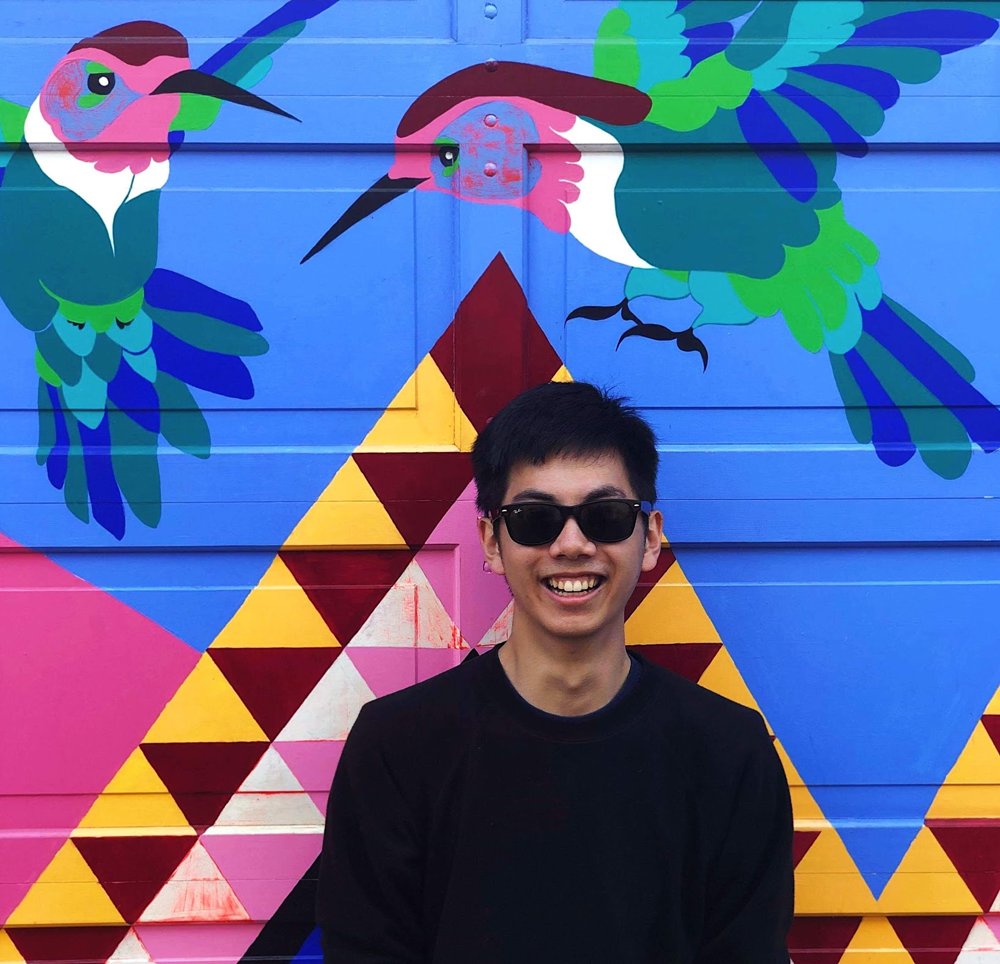
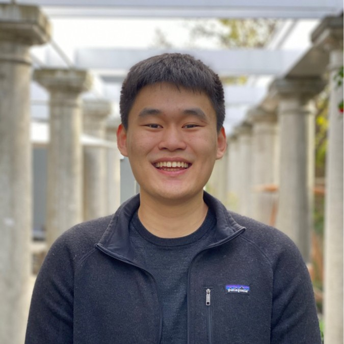

Production runs on [Vercel + Turso](turso/README.md).

<h1 align="center">
  <br />
  <a href="https://www.lifeafterhate.org/"
    ></a>
  <br />
  Life After Hate
  <br />
</h1>

<h4 align="center">
  A
  <a href="https://uiuc.hack4impact.org/" target="_blank">Hack4Impact UIUC</a>
  project.
</h4>

<p align="center">
  <a
    href="https://github.com/hack4impact-uiuc/life-after-hate/actions?query=branch%3Amaster"
    ></a>
  <a href="https://codecov.io/gh/hack4impact-uiuc/life-after-hate"
    ></a>
</p>

# About This Project

_"Each year, more than 250,000 people in the United States are victims of hate crimes. The vast majority are violent and more than half go unreported. Between 2008 and 2017, 71 percent of extremist-related fatalities in the U.S. were committed by members of the far right or white-supremacist movements. LAH helps people leave the violent far-right to connect with humanity and lead compassionate lives."_

\- Life After Hate

When helping people leave hate groups, LAH staff members need to sift through their resources located on many different platforms: Excel, email, paper, and more. These resources can be either businesses or organizations that will support ex-hate group members willing to change.

This time sunk looking for resources is time not spent helping people exit hate groups, limiting LAH's reach as an organization. This bottleneck in the support process can also take up to days to complete. By automating and organizing the search process, we can speed up the process of matching resources to formers. We wanted to create a highly-secure, easily searchable, centralized web application to host and manage these resources. This way, we can enable LAH to spend more time serving people and accomplish their mission on a larger scale.

To learn more details about the project, please view the official [case study](https://www.evaneckels.com/work/life-after-hate).

# Team

<table align="center">
  <tr>
    <td align="center">
      <a href="https://www.linkedin.com/in/alan-fang/"
        ><br /><b>Alan Fang</b></a
      ><br /><sub>Product Manager</sub>
    </td>
    <td align="center">
      <a href="https://joshbyster.com"
        ><br /><b>Josh Byster</b></a
      ><br /><sub>Technical Lead</sub>
    </td>
    <td align="center">
      <a href="https://www.evaneckels.com"
        ><br /><b>Evan Eckels</b></a
      ><br /><sub>Product Designer</sub>
    </td>
    <td align="center">
      <a href="https://www.linkedin.com/in/alicesf2/"
        ><br /><b>Alice Fang</b></a
      ><br /><sub>Software Developer</sub>
    </td>
  </tr>
  <tr></tr>
  <tr>
    <td align="center">
      <a href="https://www.linkedin.com/in/rebeccaxun/"
        ><br /><b>Rebecca Xun</b></a
      ><br /><sub>Software Developer</sub>
    </td>
    <td align="center">
      <a href="https://github.com/laurenho025"
        ><br /><b>Lauren Ho</b></a
      ><br /><sub>Software Developer</sub>
    </td>
    <td align="center">
      <a href="https://www.linkedin.com/in/genewang0/"
        ><br /><b>Gene Wang</b></a
      ><br /><sub>Software Developer</sub>
    </td>
    <td align="center">
      <a href="https://www.linkedin.com/in/albertcao00/"
        ><br /><b>Albert Cao</b></a
      ><br /><sub>Software Developer</sub>
    </td>
  </tr>
  <tr>
    <td align="center">
      <a href="https://www.linkedin.com/in/eugenia-chen-3aa251131/"
        ><br /><b>Eugenia Chen</b></a
      ><br /><sub>Software Developer</sub>
    </td>
    <td align="center">
      <a href="https://www.linkedin.com/in/angad-garg/"
        ><br /><b>Angad Garg</b></a
      ><br /><sub>Software Developer</sub>
    </td>
    <td align="center">
      <a href="https://www.linkedin.com/in/aryn/"
        ><br /><b>Aryn Harmon</b></a
      ><br /><sub>Software Developer</sub>
    </td>
    <td align="center">
      <a href="https://www.linkedin.com/in/josh-burke/"
        ><br /><b>Josh Burke</b></a
      ><br /><sub>Software Developer</sub>
    </td>
  </tr>
</table>

# Development and verification

The app now uses Node 24 LTS, Express 5, Mongoose 9, Passport 0.7, React 18, Vite, MUI 7, and React Hook Form 7. See the [Vercel + Turso setup](turso/README.md) for the current production configuration.

## Local setup

1. Install Node 24 (`nvm install` / `nvm use`) and Docker with Compose v2.
2. Copy `.env.example` to `.env`, generate a random session secret, and supply Google OAuth, Mapbox, and MapQuest credentials. Register `http://localhost:3000/api/auth/login/callback` in Google Cloud. The frontend proxies `/api` to the backend.
3. Run `docker compose up --build`, then open `http://localhost:3000`.

For synthetic local testing with authentication bypass: `./scripts/lahutil up --admin`. The helper needs no npm dependencies. Production explicitly rejects authentication bypass.

Seeding **replaces local data** and must be intentional:

```sh
./scripts/lahutil seed --confirm-local-data-loss
```

Normal `./scripts/lahutil down` preserves database volumes. The old global Docker cleanup and remote environment-file download commands were removed.

## Tests and build

```sh
npm ci --ignore-scripts
npm ci --prefix backend --ignore-scripts
npm ci --prefix frontend
npm ci --prefix scripts/db_backup/backup --ignore-scripts
npm run lint
npm test
npm run build
cd frontend
npx playwright install chromium
npm run test:e2e
```

Backend tests create a disposable MongoDB instance; the first run downloads its binary. They never connect to your configured `DB_URI`. Browser tests use synthetic API responses and do not need external credentials. The older Cypress fixtures remain as historical workflow references; Playwright is the maintained browser suite.

## Deployment and migration

See the [deployment guide](turso/README.md) for Google OAuth, database configuration, and deployment requirements. Deployment requires explicit configuration; no production services are changed by installing dependencies or running tests.

For native local development outside Docker, set `DB_URI` to an isolated local MongoDB, run the backend from `backend/` with its environment supplied, and start the frontend from `frontend/`. Vite proxies `/api` to `127.0.0.1:5000` by default. Use `API_PROXY_TARGET` to change that internal development target.

# Credits

We want to give credit to the following open source packages (non-exhaustive list):

Frontend packages:

- [React](https://reactjs.org/) for creating the single page application
- [Redux](https://redux.js.org/) for state management
- [DeckGL](https://deck.gl/#/) for rendering resources on a map
- [MapboxGL](https://www.mapbox.com/) for providing the main map view

Backend packages:

- [Express](https://expressjs.com/) for the API layer
- [Mongoose](https://mongoosejs.com/) for interactions with MongoDB
- [Passport](http://www.passportjs.org/) for authentication
- [Joi](https://github.com/hapijs/joi) for schema validation
- [Fuse](https://fusejs.io/) for fuzzy searching
- [Ramda](https://ramdajs.com/) for functional programming utilities

Testing:

- [Playwright](https://playwright.dev/) for browser workflow testing
- [Vitest](https://vitest.dev/) for frontend regression testing
- [Mocha](https://mochajs.org/) for backend testing

# License

Copyright 2020 Hack4Impact UIUC

Permission is hereby granted, free of charge, to any person obtaining a copy of this software and associated documentation files (the "Software"), to deal in the Software without restriction, including without limitation the rights to use, copy, modify, merge, publish, distribute, sublicense, and/or sell copies of the Software, and to permit persons to whom the Software is furnished to do so, subject to the following conditions:

The above copyright notice and this permission notice shall be included in all copies or substantial portions of the Software.

THE SOFTWARE IS PROVIDED "AS IS", WITHOUT WARRANTY OF ANY KIND, EXPRESS OR IMPLIED, INCLUDING BUT NOT LIMITED TO THE WARRANTIES OF MERCHANTABILITY, FITNESS FOR A PARTICULAR PURPOSE AND NONINFRINGEMENT. IN NO EVENT SHALL THE AUTHORS OR COPYRIGHT HOLDERS BE LIABLE FOR ANY CLAIM, DAMAGES OR OTHER LIABILITY, WHETHER IN AN ACTION OF CONTRACT, TORT OR OTHERWISE, ARISING FROM, OUT OF OR IN CONNECTION WITH THE SOFTWARE OR THE USE OR OTHER DEALINGS IN THE SOFTWARE.

---

> [lifeafterhate.org](https://www.lifeafterhate.org) &nbsp;&middot;&nbsp;
> GitHub [@hack4impact-uiuc](https://github.com/hack4impact-uiuc/) &nbsp;&middot;&nbsp;
> Website [uiuc.hack4impact.org](https://uiuc.hack4impact.org)
